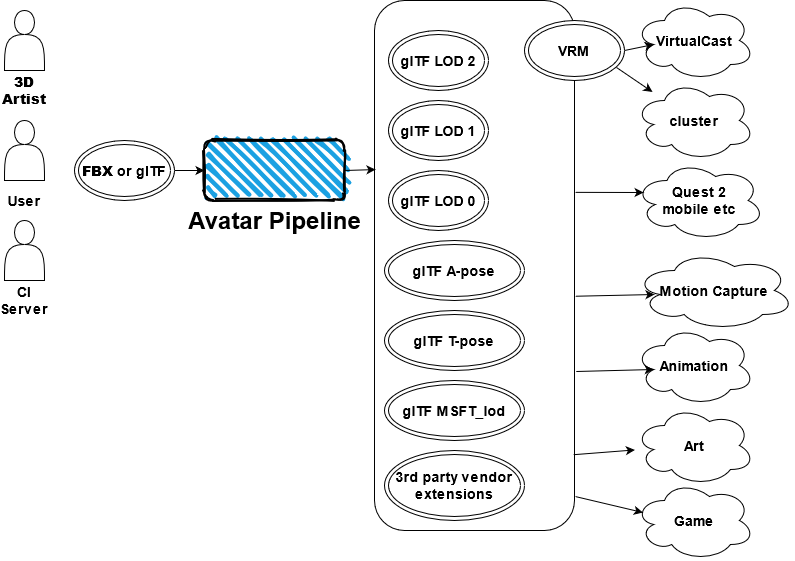
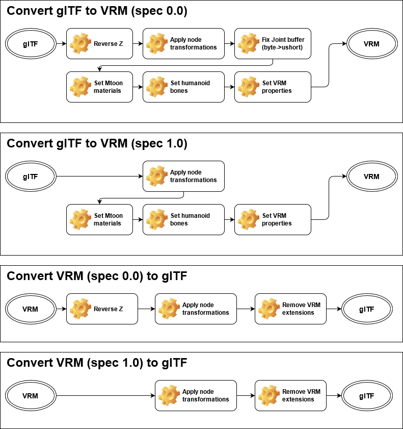

# :diamond_shape_with_a_dot_inside: avatar-asset-pipeline [](https://github.com/infosia/avatar-asset-pipeline/actions/workflows/cmake.yml) 

Avatar asset pipeline is a tool to create continuous integration build pipelines for avatar development using set of common transformation logic as a components, such as "A-pose to T-pose". The build pipelines are defined in a declarative way using JSON file.

**[[[Work In Progress]]]**

## Background

  

<sub>[The Tower of Babel (Vienna) By Pieter Brueghel the Elder - Google Cultural Institute](https://commons.wikimedia.org/w/index.php?curid=22178101)</sub>

> According to the story, a united human race in the generations following the Great Flood, speaking a single language and migrating eastward, comes to the land of Shinar. There they agree to build a city and a tower tall enough to reach heaven. God, observing their city and tower, confounds their speech so that they can no longer understand each other, and scatters them around the world. 

Avatar asset pipeline is aiming to help common workflows for both 3D artist and avatar asset user. For instance avatar pipeline helps you to:

* Create multiple LOD (Level of Details) assets in order to support multiple platforms such as standalone VR headset device like Oculus Quest, while preserving your original asset clean
* Create T-pose asset from A-pose asset so 3D artist don't have to do it manually every time asset is updated
* Create glTF asset using 3rd party vendor extensions such as VRM without using Unity nor other 3D DCC tools at all
* Integrate build pipeline onto your CI build environment as everything can be done on command line interface with easy-to-read-and-update JSON configurations.



## Usage

Check out `pipelines` directory for working pipeline examples in practice.

```
> avatar-build.exe --pipeline pipelines/glb2vrm0_T_pose.json --debug --output_config models/output.vrm0.json -v --fbx2gltf extern/fbx2gltf.exe --input_config models/input.readyplayerme.json -i models/readyplayerme-feminine.glb -o models/readyplayerme-feminine.vrm
```

## Options

* `--pipeline`: Pipeline configuration file name (JSON);
* `--verbose`: verbose Verbose log output
* `--debug`: Enable debug output (such as JSON dump)
* `--input`: Input file name
* `--output` "Output file name
* `--input_config`: Input configuration file name (JSON)
* `--output_config`: Output configuration file name (JSON)
* `--fbx2gltf`: Path to fbx2gltf executable

## Features

- [x] Apply all node transforms (compatible with mixamo, VRM etc)
- [x] Convert FBX to glTF binary (.glb)
- [x] Convert FBX to VRM
- [x] Convert glTF binary to VRM
- [x] Create glTF binary back from VRM
- [x] Change A-pose to T-pose (and vice versa)
- [x] Convert all jpeg textures to png
- [x] Remove animations
- [x] Reverse Z axis
- [x] Pack external textures
- [x] Update material properties
- [x] Update VRM properties
- [ ] Create multiple Level of Details (LOD)
- [ ] Pack multiple LOD into glTF (MSFT_lod)
- [ ] Index optimization
- [ ] Vertex cache optimization
- [ ] Overdraw optimization
- [ ] Vertex fetch optimization
- [ ] Vertex quantization
- [ ] Vertex/index buffer compression

## Tested Platforms

- [x] [Ready Player Me](https://fullbody.readyplayer.me/) Full-body avatars (.glb)
- [x] [Adobe mixamo](https://www.mixamo.com/) avatars (.fbx)
- [x] [Microsoft Rocketbox](https://github.com/microsoft/Microsoft-Rocketbox) avatars (.fbx)
- [x] [THE SEED ONLINE](https://seed.online/) (.vrm)
- [x] [VRoid Hub](https://hub.vroid.com/) (.vrm)
- [x] [Cluster](https://cluster.mu/) (.vrm)

## Common transformations in practice

### Convert A-pose to T-pose glTF binary (.glb)

```json
{
  "name":"glb_T_pose",
  "description":"T-pose from A-pose glTF binary (.glb)",
  "pipelines":[
    {
      "name":"gltf_pipeline",
      "components":[
        "glb_T_pose"
      ]
    }
  ]
}
````

```
> avatar-build.exe --pipeline pipelines/glb_T_pose.json --debug -v --input_config models/input.readyplayerme.json -i models/readyplayerme-feminine.glb -o models/readyplayerme-feminine.Tpose.glb
````

*glb_T_pose* component can be used to change default pose. Pose configuration can be specified by input config (`--input_config`). Checkout `models/input.*.json` for commonly used configurations. Following example defines "T" pose, there are `rotation` configurations in order to make current pose to "T" pose. All rotations are quaternions and *multiplied* to current rotations when `glb_T_pose` is executed. Bone naming conventions are described in [bone naming conventions](#bone-naming-conventions) section. Note that all animations are removed after glb_T_pose because animation "baking" is not working well with default pose changes.

```js
"poses":{
  "T": {
    "LeftUpperArm":  {
      "rotation": [ -0.5, 0, 0, 0.866 ] // rotate [-60, 0, 0] degrees (euler angles)
    },
    "RightUpperArm": {
      "rotation": [ -0.5, 0, 0, 0.866 ] // rotate [-60, 0, 0] degrees (euler angles)
    },
    "LeftLowerArm": {
      "rotation": [ 0, 0, -0.128, 0.992 ] // rotate [0, 0, -15] degrees (euler angles)
    },
    "RightLowerArm": {
      "rotation": [ 0, 0, 0.128, 0.992 ] // rotate [0, 0, 15] degrees (euler angles)
    },
    "LeftHand": {
      "rotation": [ 0, -0.128, 0, 0.992 ] // rotate [0, -15, 0] degrees (euler angles)
    },
    "RightHand": {
      "rotation": [ 0, 0.128, 0, 0.992 ] // rotate [0, 15, 0] degrees (euler angles)
    }
  }
}
```

### Convert A-pose to T-pose glTF binary (.glb) and apply all node transforms

*glb_transforms_apply* component applies all node transforms to make sure nodes have no scale and rotation.

```json
{
  "name":"glb_T_pose",
  "description":"T-pose from A-pose glTF binary (.glb) and make bones mo-cap ready",
  "pipelines":[
    {
      "name":"gltf_pipeline",
      "components":[
        "glb_T_pose",
        "glb_transforms_apply"
      ]
    }
  ]
}
```

### Convert FBX to glTF binary (.glb)

```json
{
  "name":"fbx2glb",
  "description":"Convert FBX to glTF binary (.glb)",
  "pipelines":[
    {
      "name":"fbx_pipeline",
      "components":[
        "fbx2gltf_execute"
      ]
    }
  ]
}
```

```
> avatar-build.exe --pipeline pipelines/fbx2glb.json --debug -v --fbx2gltf extern/fbx2gltf.exe --input_config models/input.mixamo.json -i models/xbot.fbx -o models/xbot.glb
```

Conversion of FBX to glTF using `fbx_pipeline` requires [FBX2glTF executable](https://github.com/facebookincubator/FBX2glTF/releases). In order to use FBX2glTF with asset pipeline you need to specify a path to the executable using `--fbx2gltf` option such as `--fbx2gltf extern/fbx2gltf.exe`.

## Common transformations for VRM

### Convert A-pose to T-pose, glTF binary (.glb) to VRM spec 0.0

```json
{
  "name":"glb2vrm0_T_pose",
  "description":"Convert A-pose to T-pose, glTF binary (.glb) to VRM spec 0.0",
  "pipelines":[
    {
      "name":"gltf_pipeline",
      "components":[
        "glb_T_pose",
        "glb_transforms_apply",
        "glb_z_reverse",
        "vrm0_fix_joint_buffer",
        "vrm0_default_extensions"
      ]
    }
  ]
}
```

```
> avatar-build.exe --pipeline pipelines/glb2vrm0_T_pose.json --debug --output_config models/output.vrm0.json -v --input_config models/input.readyplayerme.json -i models/readyplayerme-feminine.glb -o models/readyplayerme-feminine.vrm
```

*vrm0_fix_joint_buffer* component is practically needed for VRM spec 0.0 because UniVRM (VRM spec 0.0 reference implementation) does not support unsigned short joint buffer until UniVRM v0.68.0.

### Convert glTF binary (.glb) to VRM spec 0.0, forcing all jpeg textures to png

This has been needed to support platforms that do not enable jpeg texture such as [Cluster](https://cluster.mu/en/).

```json
{
  "name":"glb2vrm0",
  "description":"Convert glTF binary (.glb) to VRM spec 0.0, forcing all jpeg textures to png",
  "pipelines":[
    {
      "name":"gltf_pipeline",
      "components":[
        "glb_transforms_apply",
        "glb_z_reverse",
        "glb_jpeg_to_png",
        "vrm0_fix_joint_buffer",
        "vrm0_default_extensions"
      ]
    }
  ]
}
```



## Combining multiple pipelines

```js
{
  "name":"fbx2glb_tpose",
  "description":"Convert FBX to glTF binary (.glb), make it T-pose and then VRM 0.0",
  "pipelines":[
    {
      "name":"fbx_pipeline",
      "components":[
        "fbx2gltf_execute"
      ]
    }, 
    {
      "name":"gltf_pipeline",
      "components":[
        "glb_T_pose",
        "glb_transforms_apply",
        "glb_z_reverse",
        "vrm0_fix_joint_buffer",
        "vrm0_default_extensions"
      ]
    }
  ]
}
```


## Bone naming conventions

avatar asset pipeline assumes bone names to use [Human Body Bones](https://docs.unity3d.com/ScriptReference/HumanBodyBones.html) conventions following Blender-like naming conversions in order to search for humanoid bone retargeting.

> First you should give your bones meaningful base-names, like “leg”, “arm”, “finger”, “back”, “foot”, etc.
> If you have a bone that has a copy on the other side (a pair), like an arm, give it one of the following separators:
>
> * Left/right separators can be either the second position “L_calfbone” or last-but-one “calfbone.R”.
> * If there is a lower or upper case “L”, “R”, “left” or “right”, Blender handles the counterpart correctly. See below for a list of valid separators. Pick one and stick to it as close as possible when rigging; it will pay off.
>
> Examples of valid separators:
>
> * (nothing): handLeft –> handRight
> * “_” (underscore): hand_L –> hand_R
> * “.” (dot): hand.l –> hand.r
> * “-” (dash): hand-l –> hand-r
>* ” ” (space): hand LEFT –> hand RIGHT

<sub>https://docs.blender.org/manual/en/latest/animation/armatures/bones/editing/naming.html</sub>

You can explicitly specify bone naming conversions by using `--input_config` option such as `--input_config models/input.mixamo.json`. Checkout `models/input.*.json` for commonly used bone naming conversions.

```js
{
  "config":{
    "pattern_match": true, // pattern match ("Hips" matches "mixamorig:Hips" too)
    "with_any_case": true, // case insensitive
  },
  "bones":{
    "Hips":"Hips",
    "LeftUpperLeg":"LeftUpLeg",
    "RightUpperLeg":"RightUpLeg",
    "LeftLowerLeg":"LeftLeg",
    "RightLowerLeg":"RightLeg",
    "LeftFoot":"LeftFoot",
    "RightFoot":"RightFoot",
    "Spine":"Spine",
    "Chest":"Spine1",
    "Neck":"Neck",
    "Head":"Head",
    "LeftShoulder":"LeftShoulder",
    "RightShoulder":"RightShoulder",
    ...
  }
}
```

## Material properties override (Experimental)

In output configuration file (which can be specified by `--output_config` option) you can override some material properties using `overrides` property. In order to select material which you want to override you can set `rules` by standard regular expressions. Following example shows a rule to search for the material that contains *_MAT* in its `name` property following numeric value in suffix. The `values` property is the values to override. Currently `alphaMode` and `doubleSided` property values can be overridden (all conversion logic are inside `gltf_override_material_values` function in `gltf_overrides_func.inl` for now)

```js
"overrides": {
  "materials": [
    {
      "rules": {
        "name":"(?:.+)(?:_MAT)(?:[1-9])?" // matches all materials that has a name "Skin_MAT", "Body_MAT1" etc
      },
      "values":{
        "alphaMode":"OPAQUE" // changes the alphaMode property to OPAQUE
      }
    }
  ]
}
```

### Find and load external material textures

When you use FBX, materials can be defined as external texture image asset and the conversion tool `FBX2glTF` tend to fail to fetch those textures. In order to fetch these missing textures, you can use `find_missing_textures_from` property. It searches for the textures in given directory and tries to load it as glTF buffer. For instance following configuration shows that material textures under `Missing.Textures` directory to be loaded as `f001_body` material.  It searches for the missing textures based on glTF `name` property in following order: 1. `image.name` that is linked to the material, 2. `texture.name` that is linked to the material, 3. `material.name`. It also takes *"_color"* suffix into account. Note that only png and jpg textures are supported for now.

```js
"overrides": {
  "materials": [
    {
      "rules": {
        "name":"f001_body", // searches a material that has a name "f001_body"
        "find_missing_textures_from": "Missing.Textures"
        // searches textures under the directory (relative to this configuration file)
      }
    }
  ]
}
```

So let say if you have following glTF property, the configuration above searches for image files under `Missing.Textures` directory in following order:

1. "Image #01" (.png, .jpg, .jpeg )
2. "Image #01_color" (.png, .jpg, .jpeg )
3. "Texture #01" (.png, .jpg, .jpeg )
4. "Texture #01_color" (.png, .jpg, .jpeg )
3. "f001_body" (.png, .jpg, .jpeg )
4. "f001_body_color" (.png, .jpg, .jpeg )

```js
"images": [
  {
    "name": "Image #01",
  }
]
...
"textures": [
  {
    "name": "Texture #01",
    "source": 0
  }
]
 ...
"materials": [
  {
    "name": "f001_body",
    "pbrMetallicRoughness": {
      "baseColorTexture": {
        "index": 0
      },
      ...
    }
  }
]
```

## License

* Available to anybody free of charge, under the terms of MIT License (see LICENSE).

## Building

You need [Cmake](https://cmake.org/download/) and Visual Studio with C++ environment installed. There is a CMakeLists.txt file which has been tested with [Cmake](https://cmake.org/download/) on Windows. For instance in order to generate a Visual Studio 10 project, run cmake like this:


```
> mkdir build; cd build
> cmake -G "Visual Studio 10" ..
```
